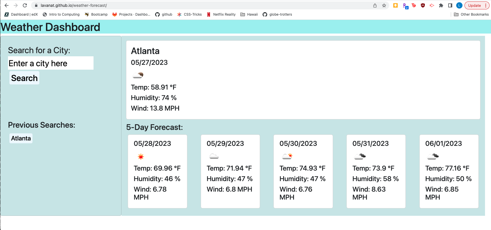

# weather-forecast
Displays a 5-day weather forecast for user-selected city via OpenWeather API

## Description

This application provides a current-day and 5-day forecast of a city selected by the user. It also saves the previous searches as easily accessible buttons.

## Usage

You can use this page to get the weather for your city.

## Link to Deployed Application

https://lavanat.github.io/weather-forecast/

## Screenshot of Deployed Application

